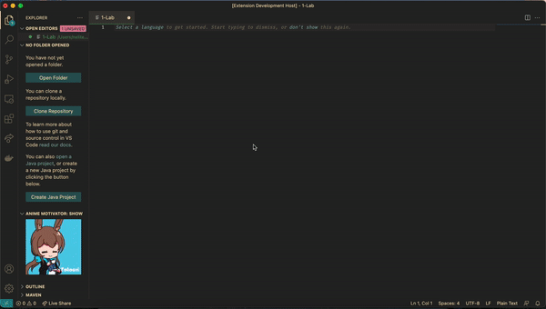

# vscode-anime-motivator

A Visual Studio Code extension that motivates you with anime gifs and stuff

## Features

- Show afk/working gifs
- Adds you some motivation to work harder, all in the name of anime girls.

## Repository info

There will be a few branches for this extension:

- **main** - major releases will be happening there.
- **beta** - for features preview. Will mostly be stable to use, but something might occasionally break.
- **dev** - for developing purposes. The only reason you might want to look in there is if you wanna see the progress of this extension being developed.

## Extension Settings

Once you install this extension, an icon will appear on your Activity Bar. You might want to drag it to the Explorer view if you want to see it working will you... well... work on your files.

## Known Issues

- Too little features (Is gonna be fixed as time passes)

## Release Notes

### 1.0.0

Initial release of the extension

- Added working/afk gifs support
